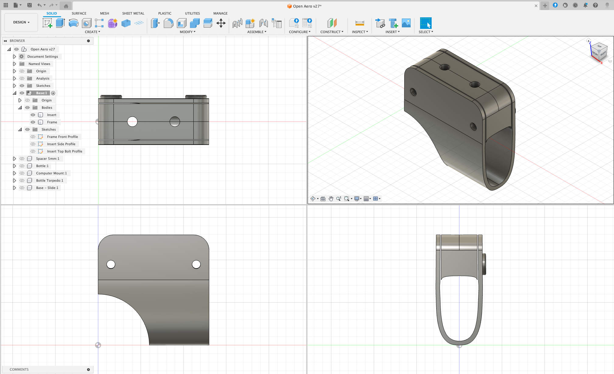

# 2020+ Canyon Speedmax CF SLX - Clamp Version 1

## Overview

Provides a base mount for a the Canyon GP0226 Aerobar and can be installed without dissasembling the aerobars.

### Design Model
Bike used to design the part: 2025 Canyon Speedmax CF SLX

### Specs
Height: 24mm
Width:
Length:

### Accessory Mount Specs
Base Mount: 21mm x 47mm (Standard)
Bolt Depth Required: 12.5mm

### Hardware Required

2 x 30mm M5 Button Head Hex Bolt
2 x 3.8mm M5 Nuts

### Installation Notes

This version of the Bike Mount is clamp based which implies you do not need to remove the Speedmax extensions and can simply be bolted on. We recommend applying some tape to the mount area to improve grip and stability. Ne sure not to over tighten bolts (suggested torque, as for most carbon parts) is 5Nm.

NB: Be sure that the accessory bolts do not protrude through the base and come into contact of your bars.

### Design

