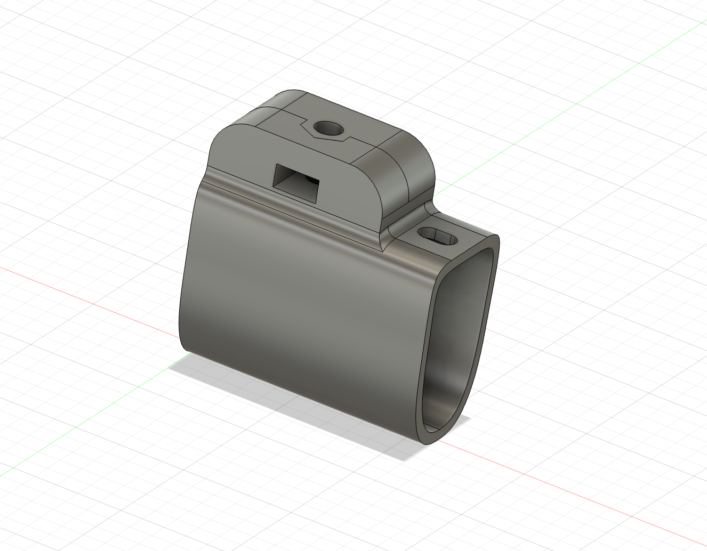

# 2020+ Canyon Speedmax CF SLX - Slide Small v1

## Overview

Provides a base mount for a the Canyon GP0226 Aerobar and can be installed by disassembling the aerobars, this is relatively easy if you are using wireless blips. The accepts small accessories such as computer mounts or a GoPro. Untested with water bottles, etc.

### Design Model
Bike used to design the part: 2025 Canyon Speedmax CF SLX

### Specs
Height: 57mm
Width: 27mm
Length: 55mm

### Accessory Mount Specs
Base Mount: 12mm x 23.5mm (Small)
Bolt Depth Required: 6mm

### Hardware Required

1 x 20mm M4 Hex Bolt (Button head suggested)
1 x ~ 4mm M4 Washer

### Installation Notes

This version of the Bike Mount is slide based which implies you need to remove the Speedmax extensions, and reuse of the existing mount holes with a new longer bolt.

NB: Be sure that the accessory bolts do not protrude through the base and come into contact of your bars.

### Design

