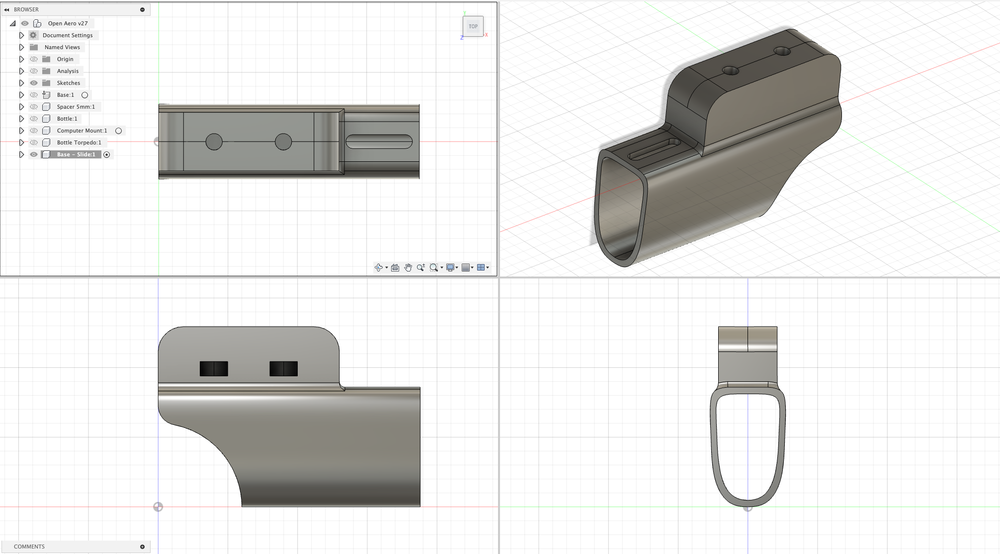

# 2020+ Canyon Speedmax CF SLX - Slide Version 1

### Design Model
Bike used to design the part: 2025 Canyon Speedmax CF SLX

### Specs
Height: 24mm
Width:
Length:

### Accessory Mount Specs
Base Mount: (Standard) 21mm x 47mm
Bolt Depth Required: 12.5mm

### Hardware Required

1 x 15mm M4 Button Head Hex Bolt
1 x ~ 4mm M4 Washer

### Installation Notes

This version of the Bike Mount is slide based which implies you need to remove the Speedmax extensions, and reuse of the existing mount holes with a new longer bolt.

NB: Be sure that the accessory bolts do not protrude through the base and come into contact of your bars.