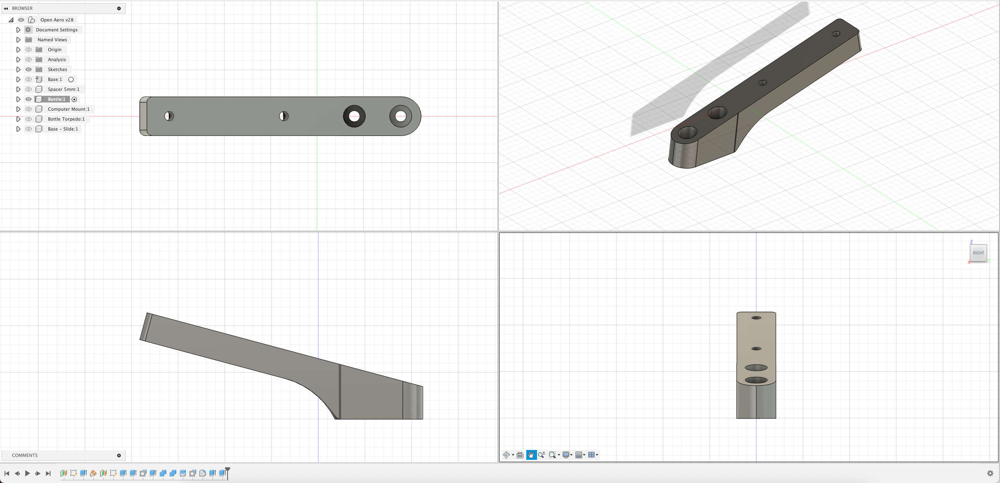

# Single Bottle Mount - Standard

## Overview

Provides a single bottle mount for the OpenAero system.

### Specs
Height: 24mm
Width: 21mm
Length: 153mm
Angle: 15 Degrees

### Accessory Mount Spec
Base Mount: 21mm x 47mm (Standard)
Bolt Length Required: 12.5mm

### Hardware Required

2 x M6 Hex Bolts - The length of the bolts will depend on which accessories are stacked on top of each other.\
2 x M6 Nuts (~9.7mm Width)\
2 x M6 Washers (<= 13mm Diameter)

### Installation Notes

None

### Design

Bottle Mount v1