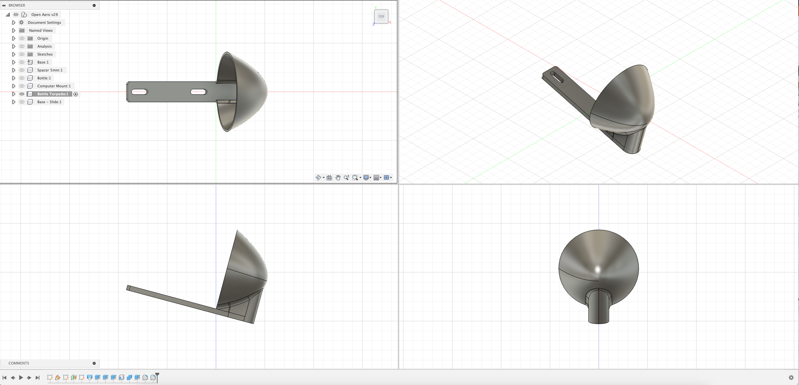

# Computer Mount

## Overview

Provides a torpedo shaped bottle cover for the OpenAero system, this is intended to provide a aerodynamic benefit for a water bottle between your arms.

### Specs
Height: 5mm\
Total Height: ~ 29mm\
Width: ~ 38mm\
Length: 148mm

### Accessory Mount Spec
Base Mount: 21mm x 47mm (Standard)\
Bolt Length Required: 5mm

### Hardware Required

None

### Installation Notes

Provides some adjustability (+- 10mm) to slide forward and backward to cater for various bottle cages.

### Design

