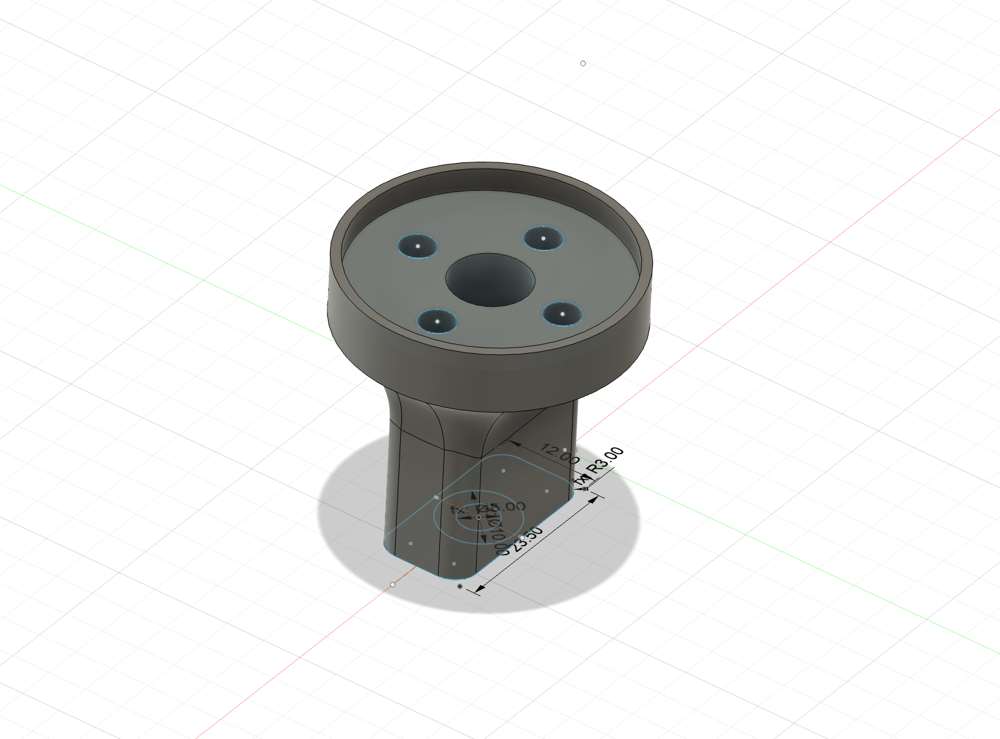

# Computer Mount - Small

## Overview

Provides a computer mount for the OpenAero system, and is raised slightly to provide access to any mounting or holes beneath the accessory. Requires a computer mount insert to be printed or purchased.

### Specs
Height: 5mm\
Total Height: ~ 36mm\
Width: ~ 36mm\
Length: 36mm

### Accessory Mount Spec
Base Mount: 12mm x 23.5mm (Small)\
Bolt Length Required: 10mm

### Hardware Required
1 x M5 Bolt
1 x Computer insert (e.g. Garmin, Wahoo, Hammerhead)\
2 x M3 bolts to attach computer insert onto accessory.\
2 x M3 Heat inserts (M3x5x6)

### Installation Notes

None

### Design

