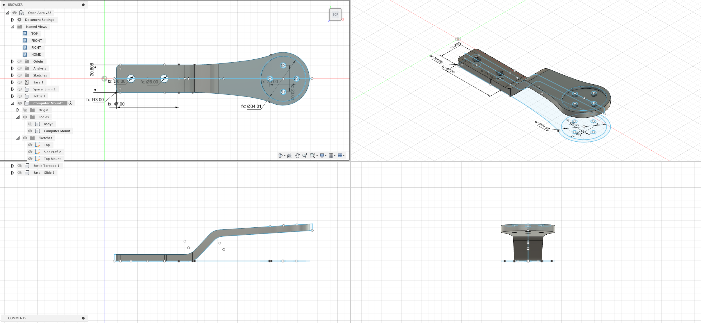

# Computer Mount - Standard

 ### 🛑 Currently has an issue with being too flexible and could break quite easily. Currently being re-designed.

## Overview

Provides a computer mount for the OpenAero system, and is raised slightly to provide access to any mounting or holes beneath the accessory. Requires a computer mount insert to be printed or purchased.

### Specs
Height: 5mm\
Total Height: ~ 29mm\
Width: ~ 38mm\
Length: 148mm

### Accessory Mount Spec
Base Mount: 21mm x 47mm (Standard)\
Bolt Length Required: 5mm

### Hardware Required
1 x Computer insert (e.g. Garmin, Wahoo, Hammerhead)\
2 x M2 bolts to attach computer insert onto accessory.\

### Installation Notes

None

### Design

