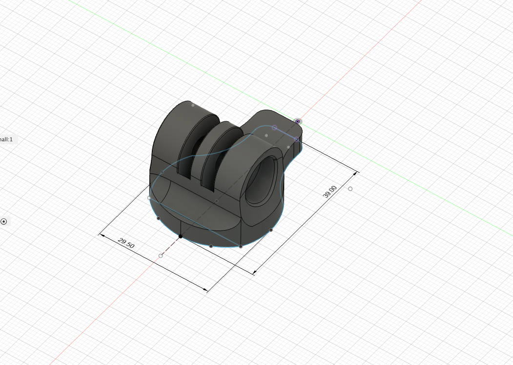

# GoPro Mount - Small

## Overview

Provides a small GoPro mount for the OpenAero system.

### Specs
Total Height: ~ 29mm\
Width: ~ 38mm\
Length: 148mm

### Accessory Mount Spec
Base Mount: 12mm x 32.5mm (Small)\
Bolt Length Required: 5mm

### Hardware Required
1 x M5 bolt
1 x M5 Nut

### Installation Notes

None

### Design

