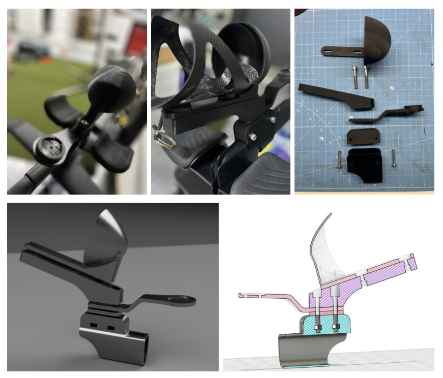
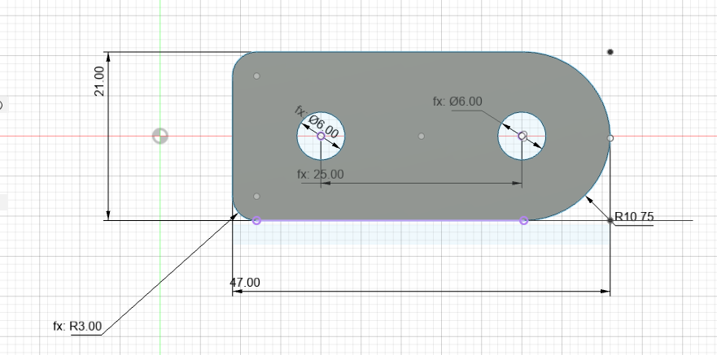
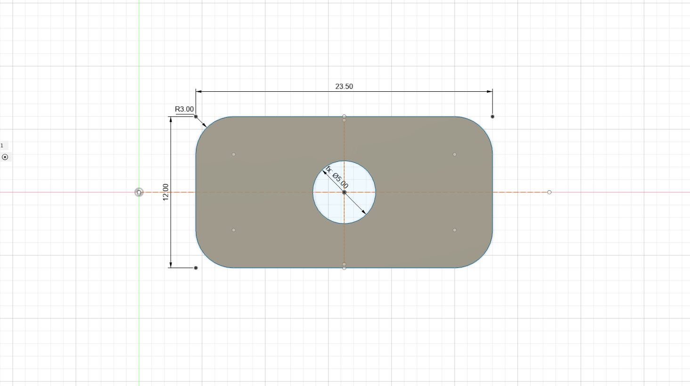

# OpenAero - A Open Source 3D-Printed Bicycle Accessory Mounting System

## Overview

The goal is to develop a modular mounting system for bicycle accessories — ranging from water bottle holders and lights to phone and cycling computers. Partially inspired by Gridfinity, this system provides a base platform and is intended to be stackable. The motivation behind the definition and open source nature of this project is to encourage community-driven design and innovation in the triathlon, and cycling space.

### Concept

The fundamental concept is to create both specific and generic base mounts per bicycle model, whereby accessories can then be attached to the base mount using a standard pattern and design allowing you to mix and match your accessory "stack" depending on your needs. Accessories are not specific to a bike or model and are rather modular, and depend on your set of requirements.

A base mount could be the seat post, handlebars, aerobars, frame or bottle cage.

### Design

Standard

Standardized rectangular base mounting system of 21mm x 47mm with two M6 bolt pattern 25mm apart in the center. 

Small

A small rectangular base mounting system of 12mm x 23.5mm with one M5 bolt in the center. 

### Printing

All bases and parts are intended to be 3D printed (many require supports), and most components require mounting hardware to be installed after printing is complete and is fairly straight forward. In all cases we recommend stainless steel, using locknut (blue) and torquing according to your manufacturers recommendations, especially when mounting the base or accessories to carbon fiber.

### Installation

In order to calculate the bolt lengths required, add up each accessories "Bolt Depth Required" on the accessories readme page.

Example:
You would like to mount a water bottle and computer mount on a Canyon Speedmax CF SLX.

Step 1. Select the Bike Mount required
Canyon Speedmax CF SLX Slide v1 - Bolt Depth Required: 12.5mm

Step 2. Select the bottle mount required
Bottle - Bolt Depth Required: 12.5mm

Step 3. Select the computer mount required
Computer Mount - Bolt Depth Required: 5mm

Step 4. Measure the height of your M6 bolt you purchased
Bolt - +- 5mm

Total bolt length: 35mm

Extremely important: ALWAYS assemble the base and accessories before installing them on your bike, to ensure no bolts or hardware will scratch or protrude into your bike frame or mounting hardware.

### ⚠️ Risk Disclaimer
This project and its associated files are provided for informational and non-commercial purposes only. All components are intended for mounting lightweight bicycle accessories only (e.g., lights, bottles, small electronics). These parts are not designed, tested, or approved for any load-bearing or safety-critical applications involving human weight or structural support.

By using or modifying these designs, you agree to assume all risks and responsibilities. The developer(s) and contributors are not liable for any injury, damage, or loss arising from the use or misuse of these components.

Always use common sense and test parts thoroughly in safe conditions before deploying them on a bicycle.

## Want to help?

Read our [Contributing Guide](CONTRIBUTING.md)