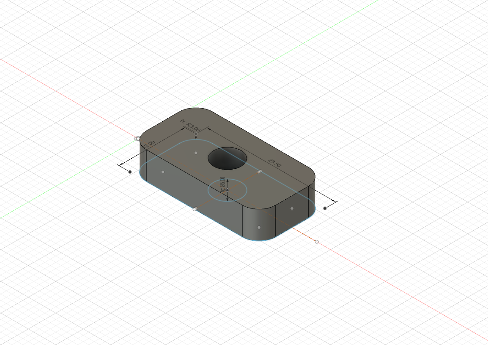

# Spacer - 5mm - Small

## Overview

Provides a small 5mm spacer for the OpenAero design system, intended to raise the height of any accessory.

### Specs

Height: 5mm\
Width: 12mm\
Length: 32.5mm\

### Accessory Mount Spec

Base Mount: 12mm x 32.5mm (Small)\
Bolt Length Required: 5mm\

### Hardware Required
None

### Installation Notes
None

### Design
